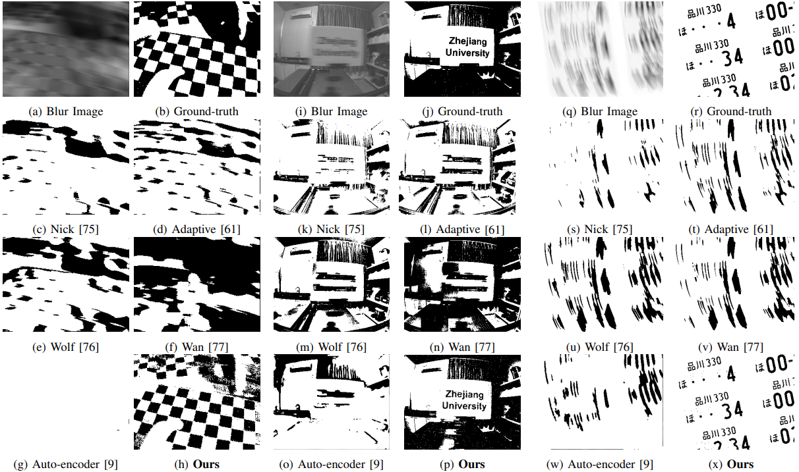
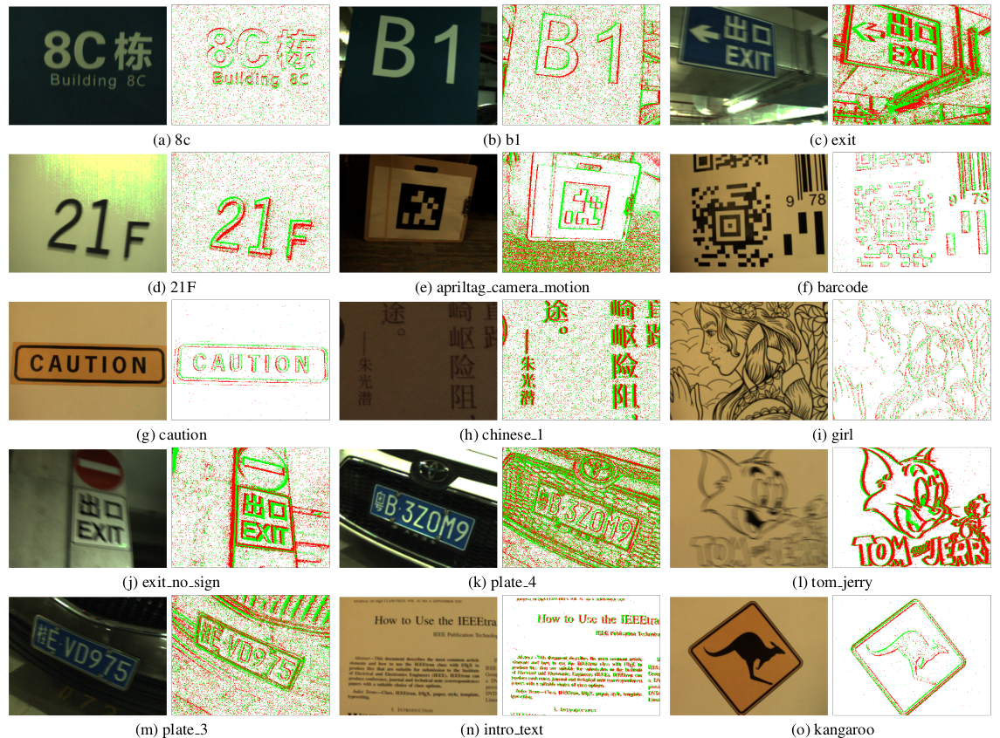
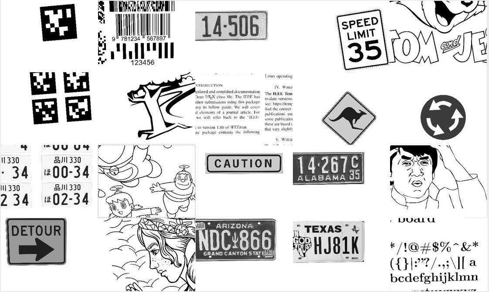

# Neuromorphic Synergy for Video Binarization (Academic Use Only)
## [Paper](https://doi.org/10.48550/arXiv.2402.12644) | [Video: Youtube](https://youtu.be/fbdvowAHkn0) | [Video: Bilibili](https://www.bilibili.com/video/BV1ws4y1X7Sh/)
## Usage
We release the matlab code for quick test and understanding.
Open matlab and run the `main.m`
I have already prepared the data to run, so you will see the results in subfolders.

## Abstract
Bimodal objects, such as the checkerboard pattern used in camera calibration, markers for object tracking, and text on road signs, to name a few, are prevalent in our daily lives
and serve as a visual form to embed information that can be easily recognized by vision systems.
While binarization from intensity images is crucial for extracting the embedded information in the bimodal objects, few previous works consider the task of binarization of blurry images due to the relative motion between the vision sensor and the environment. The blurry images can result in a loss in the binarization quality and thus degrade the downstream applications where the vision system is in motion. Recently, neuromorphic cameras offer new capabilities for alleviating motion blur,  but it is non-trivial to first deblur and then binarize the images in a real-time manner. In this work, we propose an event-based binary reconstruction method that leverages the prior knowledge of the bimodal target's properties to perform inference independently in both event space and image space and merge the results from both domains to generate a sharp binary image. We also develop an efficient integration method to propagate this binary image to high frame rate binary video. Finally, we develop a novel method to naturally fuse events and images for unsupervised threshold identification. The proposed method is evaluated in publicly available and our collected data sequence, and shows the proposed method can outperform the SOTA methods to generate high frame rate binary video in real-time on CPU-only devices.

## Download model and data
In our paper, we conduct experiments on three types of data:
- **HQF** contains synthetic blurry images and real-world events from [HQF](https://timostoff.github.io/20ecnn), where blurry images are generated using the same manner as GoPro.
- **Reblur** contains real-world blurry images and real-world events from [Reblur](https://github.com/AHupuJR/EFNet).
- **EBT** is our collected dataset, it contains simulated event sequence using ESIM and real-world test data [EBT](https://doi.org/10.25442/hku.25427659.v1).

## EBT- Event-based Bimodal Target dataset
Examples of the real sequences of EBT dataset:

Examples of the synthetic sequences of EBT dataset:

